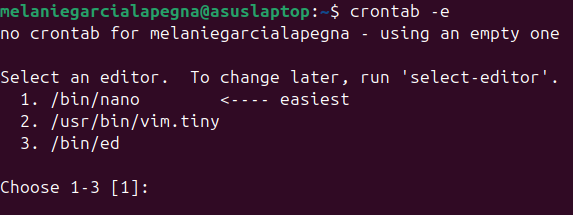

# Script para cuidar bateria en Linux:D
Envia notificación cuando la computadora se esta cargando y supera cierto porcentaje.

### Requisitos:

        sudo apt install libnotify-bin
        sudo apt install libcanberra-gtk3-module

### Pasos a seguir para utilizar el script:

1. Guardate el script en un lugar fijo, ejemplo:
    
        /home/tu_usuario/scripts/bateria.sh

2. Otorga permisos de ejecucion al archivo:

        chmod +x /home/tu_usuario/scripts/bateria.sh

3. **Crontab** se utiliza para programar tareas automaticas, abri **crontab** con :  

        
        crontab -e

    Selecciona la opcion 1 en:

    

    Luego, una vez dentro, agrega esta linea al final:

        */3 * * * * DISPLAY=:0 DBUS_SESSION_BUS_ADDRESS=unix:path=/run/user/1000/bus /home/tu_usuario/scripts/bateria.sh

    Esto hara que el script ``bateria.sh`` se ejecute cada **3** minutos.

   En caso de querer disminuir o aumentar el tiempo simplemente reemplaza el 3 con el tiempo deseado :)
   
    Obs: verifica que tu UID sea 1000 con ``echo $UID``.
    En caso de no serlo, tambien debe modificarse en las lineas *4* y *5* del script.

### Modificaciones posibles:
Yo lo puse para que me avise cuando llega al 78% pero esto puede modificarse simplemente reemplazando el 78 en la linea 16 del script.

